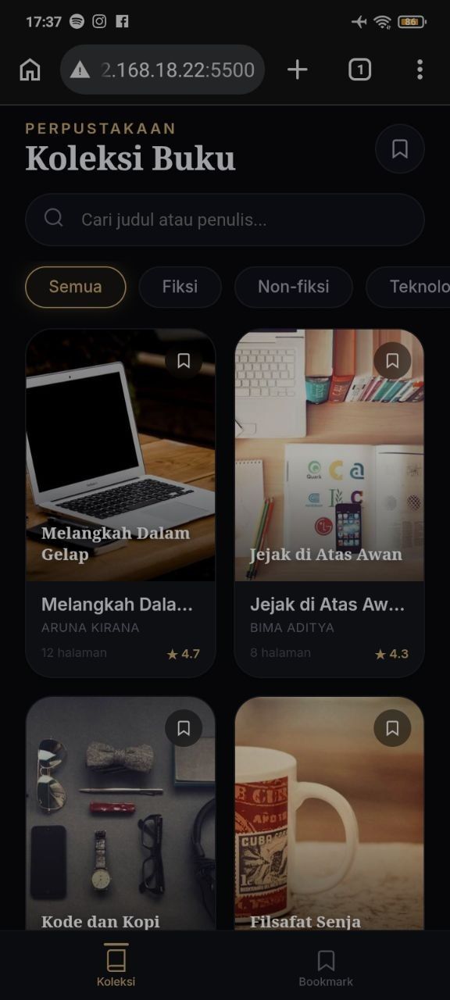
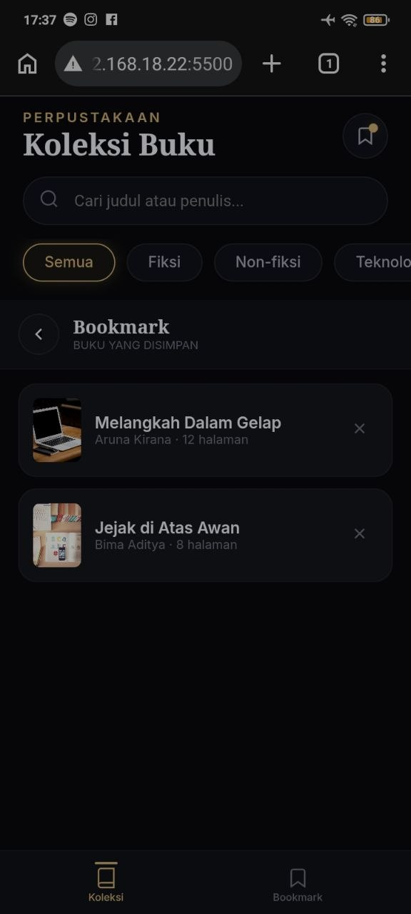
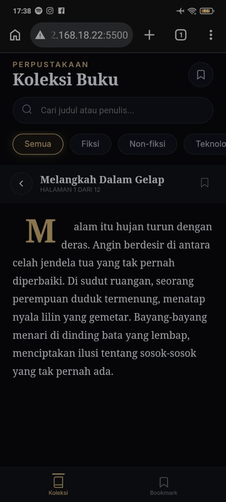

# Atheneum — Perpustakaan Buku Digital

Aplikasi perpustakaan digital modern dengan antarmuka yang elegan dan responsif. Menampilkan koleksi buku yang diambil dari file `data.json`, dilengkapi fitur pencarian, filter kategori, bookmark, dan pembaca buku internal (reader) dengan navigasi sentuh/panah.

## Fitur Utama

- **Koleksi Buku Dinamis** – Data buku (judul, penulis, kategori, halaman, rating, gambar, dan konten) diambil dari `data.json`.
- **Pencarian & Filter** – Cari buku berdasarkan judul atau penulis, filter berdasarkan kategori yang otomatis muncul dari data.
- **Bookmark** – Simpan buku favorit, lihat daftar bookmark, dan hapus bookmark kapan saja.
- **Pembaca Buku (Reader)** – Baca buku per halaman dengan drop cap di halaman pertama, progress bar, navigasi tombol, swipe kiri/kanan (mobile), dan tombol panah keyboard.
- **Header Sembunyi Saat Scroll** – Pada halaman utama, header (judul, pencarian, kategori) akan tersembunyi saat scroll ke bawah dan muncul kembali saat scroll ke atas.
- **Footer Fixed** – Navigasi bawah selalu terlihat, lebih pendek, dan tetap berada di posisi bawah layar.
- **Responsif** – Tampilan optimal di mobile (max-width 500px) dan desktop (grid menyesuaikan hingga 4 kolom).
- **Tampilan Gelap (Dark Mode)** – Desain modern dengan warna gelap dan aksen emas.

## Screenshot

> **Catatan:** Letakkan file screenshot di folder `screenshots/` dengan nama sesuai di bawah ini. Contoh gambar dapat ditambahkan setelah membuka aplikasi di browser.

### Halaman Utama (Koleksi Buku)


### Halaman Bookmark


### Halaman Isi Buku (Reader)


## Struktur File
```markdown
root/
├── index.html
├── style.css
├── script.js
├── data.json
├── pictures/
│   └── 1.jpg
└── screenshots/
    ├── home.jpg
    ├── bookmark.jpg
    └── reader.jpg
```

## Cara Menjalankan

1. Pastikan semua file di atas berada dalam satu folder dengan struktur yang sesuai.
2. Buka terminal/command prompt di folder proyek.
3. Jalankan server lokal (karena `fetch('data.json')` membutuhkan HTTP server). Contoh dengan Python:
   ```bash
   python -m http.server 8000
   ```
atau dengan Live Server di VS Code.
4. Buka browser dan akses `http://localhost:5500`

## Data Buku (data.json)
File `data.json` berisi array objek buku dengan properti:
* `id` (number)
* `title` (string)
* `author` (string)
* `category` (string) – digunakan untuk filter dinamis
* `pages` (number) – jumlah halaman (banyak item konten)
* `rating` (number) – rating 0-5
* `coverColors` (array 3 warna) – fallback jika gambar tidak ada
* `coverImage` (string) – URL atau path lokal ke gambar sampul
* `content` (array of string) – setiap string adalah satu halaman

## Teknologi yang Digunakan
* HTML5
* CSS3 (CSS Variables, Flexbox, Grid, Animasi)
* JavaScript (ES6+, Fetch API, Local Storage untuk bookmark)
* Font: Inter, Georgia

---

## Lisensi
Proyek ini bersifat open-source untuk keperluan belajar dan pengembangan.
